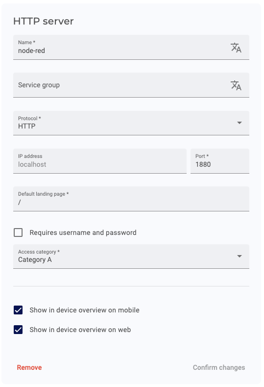

# Edge App - Node-RED with InfluxDB and Grafana for local data visualization

This project provides a comprehensive solution for collecting, storing, and visualizing data on the IXON SecureEdge Pro gateway. It leverages Node-RED for data collection and processing, InfluxDB for efficient time-series data storage, and Grafana for creating powerful visualizations. This setup allows for local data handling and visualization, reducing latency and enabling real-time monitoring and analysis of industrial processes directly on the edge gateway.

## Prerequisites

Ensure your environment is properly set up by following this guide: [Running custom Docker applications on the SecureEdge Pro](https://support.ixon.cloud/hc/en-us/articles/14231117531420-Running-custom-Docker-applications-on-the-SecureEdge-Pro).

## Local Development

docker-compose.yml in combination with configuration.env are provided for local development.

## Application Overview

This application consists of three or four containers:

1. InfluxDB: A time-series database to store the data.
2. Node-RED: A flow-based development tool for visual programming.
3. Grafana: A visualization tool for the data stored in InfluxDB.
4. Download InfluxDB Backup (optional): A web interface to download the InfluxDB backup.

**Note**
Downloading the backup may take some time, especially if done remotely. To avoid potential connection timeouts, it is strongly recommended to perform the backup download directly near the SecureEdge Pro using a LAN connection, rather than through web access.

## Steps to Deploy

### 1. Build and Push the containers

Run the `build_and_push_containers.sh` script to build and push the containers to the SecureEdge Pro:

For Unix-based systems:

```bash
./build_and_push_containers.sh
```

For Windows:

```cmd
build_and_push_containers.cmd
```

### 2. Set Up the Containers on SecureEdge Pro

- Access the local web interface of the SecureEdge Pro.

#### InfluxDB

- Create an `influxdb` container using the `influxdb` image with the following port mappings:

  ```
  Port Mapping: 8086:8086
  ```

- Create a volume with the following settings:

  ```
  Volume: influxdb-data -> /var/lib/influxdb2
  ```

- Overwrite the default environment variables, for security overwrite at least:

  ```
  DOCKER_INFLUXDB_INIT_USERNAME
  DOCKER_INFLUXDB_INIT_PASSWORD
  DOCKER_INFLUXDB_INIT_ADMIN_TOKEN
  ```

- Start the container

Refer to the screenshot for configuration details:


#### Node-RED

- Create a `node-red-influxdb` container using the `node-red-influxdb` image with the following port mappings:

  ```
  Port Mapping: 1880:1880
  ```

- Create a volume with the following settings:

  ```
  Volume: node-red-data -> /data
  ```

- Start the container

- Refer to the screenshot for configuration details:
  

#### Access Node-RED Web Interface to configure the InfluxDB connection

- In IXON Cloud, create an HTTP Web Server to easily access the Node-RED web interface on the SecureEdge Pro.

- Refer to the screenshot for configuration details:  
  

- You can now access the Node-RED web interface on the SecureEdge Pro via the HTTP Web Server you created in IXON Cloud.

- Configure the InfluxDB out node in Node-RED by adding the DOCKER_INFLUXDB_INIT_ADMIN_TOKEN value as this can not be auto populated:

- Refer to the screenshot for configuration details:  
   & 

- Click on Update and Deploy to save the changes.

#### Grafana

- Create a `grafana` container using the `grafana` image with the following port mappings:

  ```
  Port Mapping: 3000:3000
  ```

- Create a volume with the following settings:

  ```
  Volume: grafana-data -> /var/lib/grafana
  ```

- Overwrite the default environment variables, for security overwrite at least:

  ```
  GF_SECURITY_ADMIN_USER
  GF_SECURITY_ADMIN_PASSWORD
  DOCKER_INFLUXDB_INIT_ADMIN_TOKEN
  ```

  if you have changed any of your influxdb variables you also have to overwrite the following:

  ```
    DOCKER_INFLUXDB_INIT_ORG
    DOCKER_INFLUXDB_INIT_BUCKET
  ```

- Start the container

Refer to the screenshot for configuration details:


#### Access Grafana Web Interface

- In IXON Cloud, create an HTTP Web Server to easily access the Grafana web interface on the SecureEdge Pro.

- By adding a landing page and username and password you can automatically open a dashboard

- Refer to the screenshot for configuration details:  
  

- You can now access the Grafana web interface on the SecureEdge Pro via the HTTP Web Server you created in IXON Cloud.

#### Download InfluxDB backup (optional)

- Create a `download-influxdb-backup` container using the `download-influxdb-backup` image with the following port mappings:

  ```
  Port
  Mapping: 80:3001
  ```

- Create a volume with the following settings:

  ```
  Volume: influxdb-data -> /var/lib/influxdb2
  ```

- Overwrite the default environment variables, for security overwrite at least:

  ```
  DOCKER_INFLUXDB_INIT_ADMIN_TOKEN
  ```

- Start the container

- Refer to the screenshot for configuration details:
  
